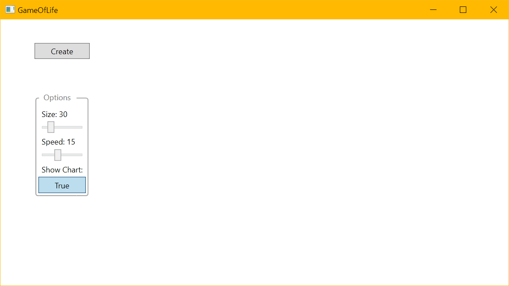
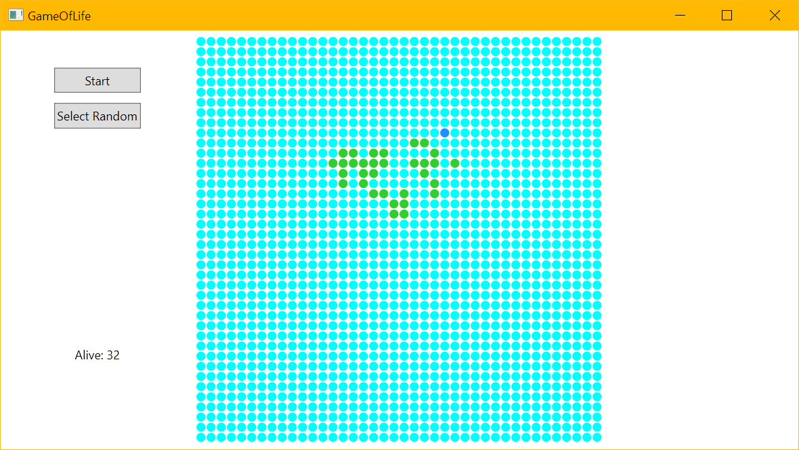
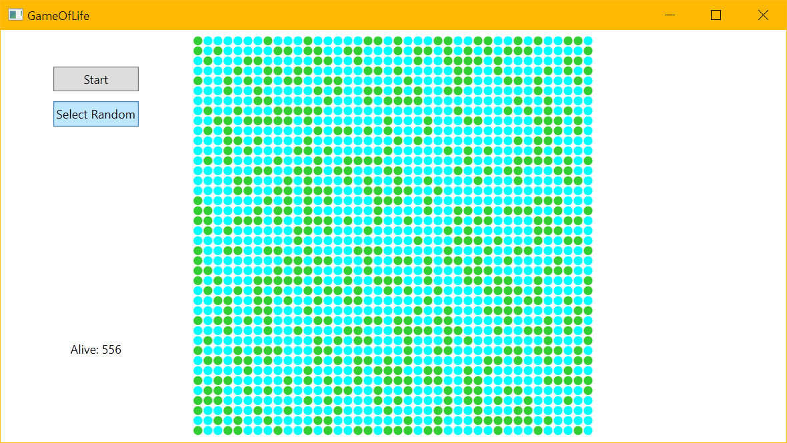
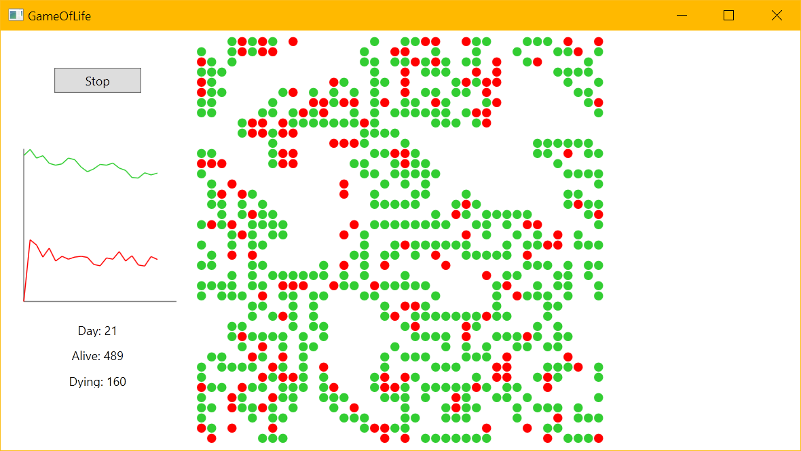

# Game of Life

## Introduction

This is a simple implementation of Conway's Game of Life in C#.
Its purpose is to kind of simulate the evolution of a population of cells.
It's definitely not the most efficient and most correct implementation, but it's one of my first ever WPF projects.
I literally just started learning WPF this week...

## How to use

### Start-Screen

When you start the application, you will be greeted by a start screen.
There you can choose the size of the grid and the speed of the simulation.
You can also choose to also show a chart about the progression of the cells' states.

#### Options

- **Grid Size**: The size of the grid. The grid is a square, so the width and height are the same.
- **Speed**: The speed of the simulation. The higher the number, the slower the simulation. The unit for this option is *milliseconds times 100*.
- **Show Chart**: Whether to show a chart about the progression of the cells' states.

### Creating a new simulation

After you have chosen the settings, you can create a new simulation.
There you can choose the initial state of the cells.
Click on the blue cells to make them alive at start.

You can also choose to randomize the cells.
This will make a random decision and set about a third of the cells to be alive.

### Running the simulation

Click on the start button to start the simulation.
You can pause it by clicking on the pause button.
When the game is paused, you can resume by clicking on the resume button.
While running the simulation you can see the current amounts of living and dying cells and also watch the chart showing the progression in case you decided to show it.

### License

This project is licensed under the [MIT License](https://en.wikipedia.org/wiki/MIT_License) - see the [LICENSE](./LICENSE.md) file for details.
